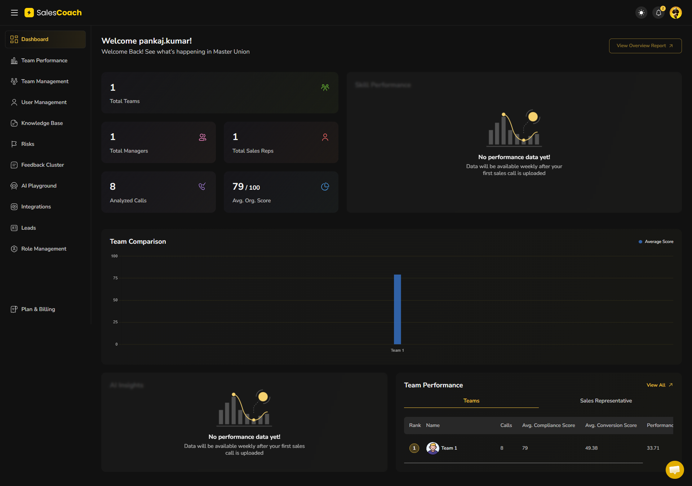
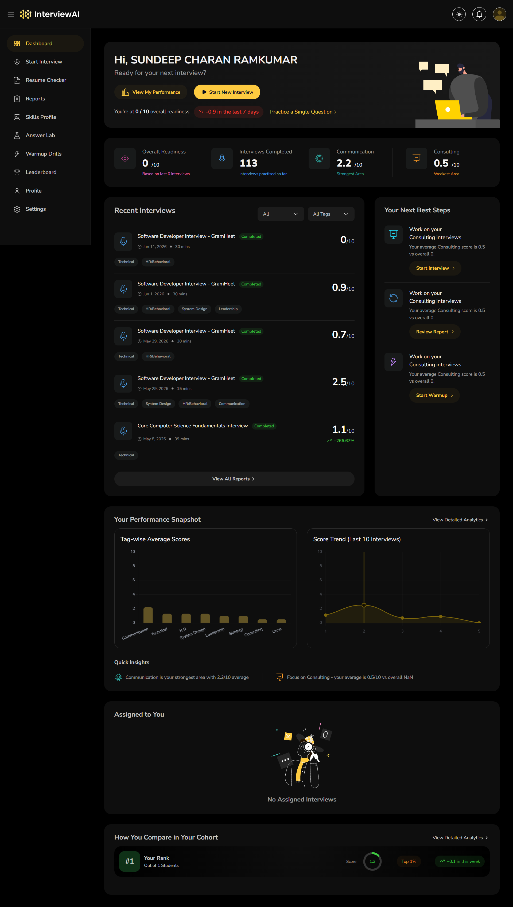
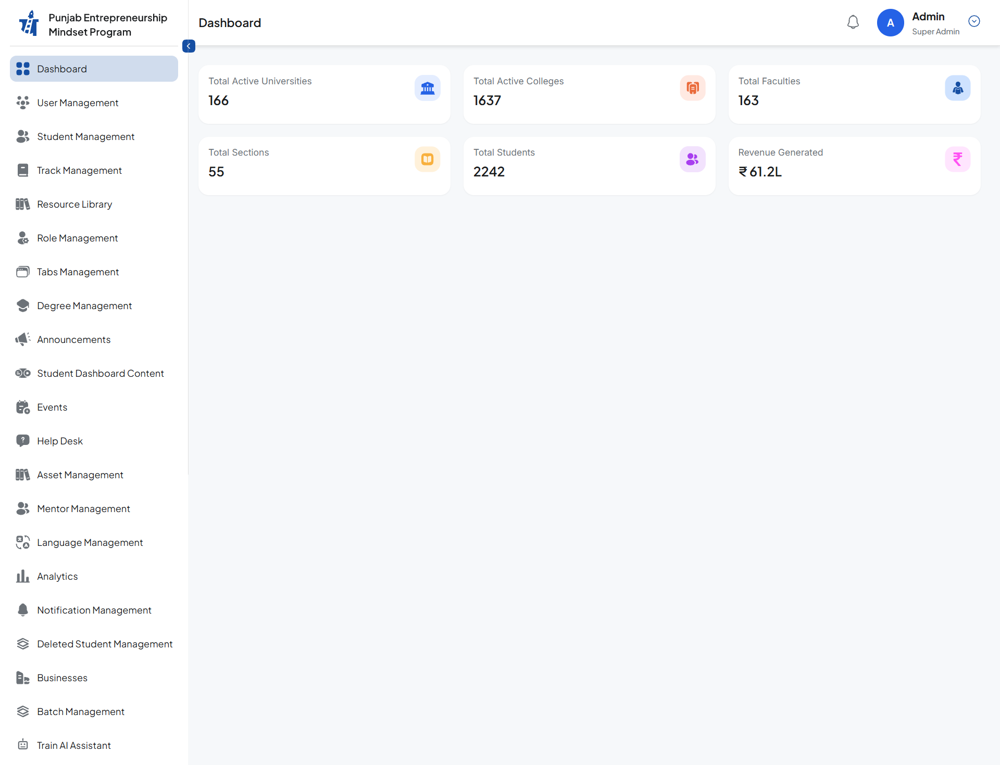
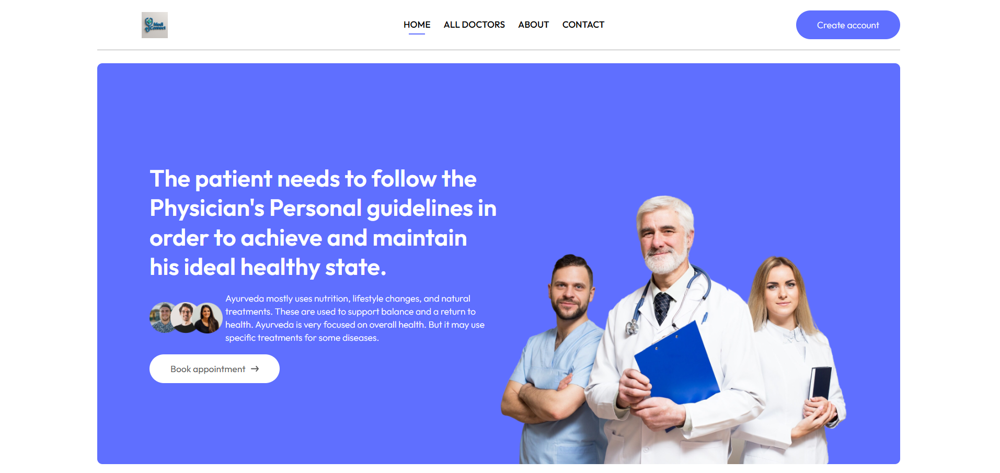
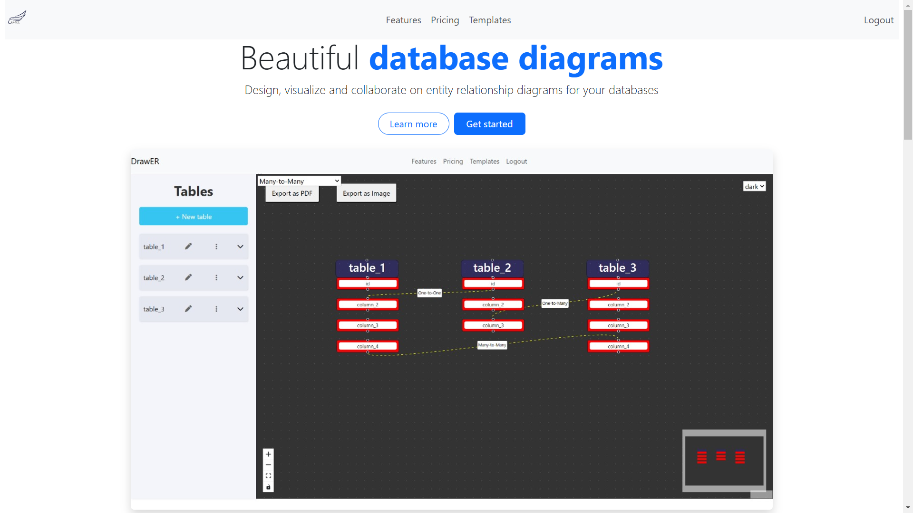
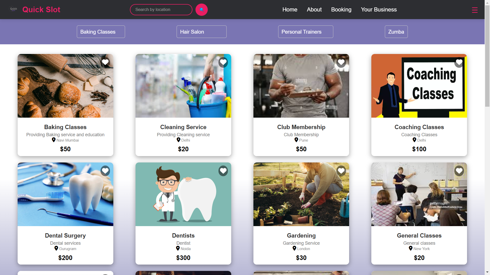

# Varad Pawar — 3D Developer Portfolio


A modern, recruiter-friendly **3D portfolio website** showcasing my experience as a **Full Stack / MERN Stack Developer**. Built with React, Three.js, Framer Motion, and Tailwind CSS — featuring interactive sections, an AI assistant chatbot, resume download, and professional project showcases.

🔗 **Live Demo:** [varadpawarportfolio.netlify.app](https://varadpawarportfolio.netlify.app)

---

## 📌 Project Description

This portfolio highlights **2+ years of software development experience**, including **1.5+ years of professional work** on client projects for **VenturePact**, **Outgrow**, and **Masters' Union**. It presents my skills, experience, certifications, and both professional and personal projects in a polished, animated single-page application with a dark purple/blue theme and 3D star-field background.

Designed for recruiters and hiring managers — easy navigation, downloadable resume, contact form, and an interactive AI chatbot that answers questions about my background.

---

## ✨ Features

- **3D animated background** — Star field powered by React Three Fiber
- **Hero section** — Animated intro, profile card, rotating titles, and key stats
- **About Me** — Professional bio with highlight cards
- **Professional Experience** — Timeline with VenturePact & Masai School internship
- **Projects** — Tabbed view (Professional / Personal) with dashboard screenshots
- **Skills** — Animated skill bars with proficiency levels
- **Education** — Academic and bootcamp credentials
- **Certifications** — Click-to-open modal with full certificate image & details
- **Resume** — Live preview, PDF download, and print support
- **Contact** — Formspree-powered contact form + social links
- **AI ChatBot** — Rule-based assistant for recruiters (skills, experience, projects)
- **Responsive design** — Mobile-friendly navigation and layouts
- **Smooth scroll** — Section-aware navbar with active link highlighting

---

## 🛠️ Tech Stack

| Category | Technologies |
|----------|-------------|
| **Frontend** | React 19, Vite 5, JavaScript (ES6+) |
| **Styling** | Tailwind CSS v4, Custom CSS animations |
| **3D / Graphics** | Three.js, React Three Fiber, @react-three/drei |
| **Animations** | Framer Motion |
| **Forms** | Formspree (contact form) |
| **Tooling** | ESLint, npm |

---

## 📁 Folder Structure

```
portfolio-3d-2/
├── public/
│   ├── assets/
│   │   ├── certificates/     # Certification images
│   │   ├── documents/        # Resume PDF files
│   │   └── images/           # Profile & project screenshots
│   ├── favicon.svg
│   └── icons.svg
├── src/
│   ├── components/
│   │   ├── canvas/           # 3D components (Stars, HeroCanvas, etc.)
│   │   ├── About.jsx
│   │   ├── Certifications.jsx
│   │   ├── ChatBot.jsx
│   │   ├── Contact.jsx
│   │   ├── Education.jsx
│   │   ├── Experience.jsx
│   │   ├── Hero.jsx
│   │   ├── Navbar.jsx
│   │   ├── Projects.jsx
│   │   ├── Resume.jsx
│   │   ├── Skills.jsx
│   │   └── AnimatedText.jsx
│   ├── constants/
│   │   └── index.js          # Central data config (single source of truth)
│   ├── utils/
│   │   └── smoothScroll.js
│   ├── App.jsx
│   ├── main.jsx
│   └── index.css
├── index.html
├── vite.config.js
├── package.json
└── README.md
```

---

## 🚀 Installation & Setup

### Prerequisites

- **Node.js** 18+ (recommended: 20.19+ for latest Vite)
- **npm** 9+

### Steps

```bash
# Clone the repository
git clone https://github.com/varad-pawar1/portfolio-3D.git
cd portfolio-3D

# Install dependencies
npm install

# Start development server
npm run dev
```

Open the URL shown in the terminal (usually `http://localhost:5173`).

### Build for production

```bash
npm run build
npm run preview
```

---

## 🔐 Environment Variables

This project uses a **central config file** instead of `.env` for portfolio content. Optional external service:

| Variable | Location | Description |
|----------|----------|-------------|
| Formspree Endpoint | `src/constants/index.js` → `personalInfo.formspreeEndpoint` | Contact form submission URL |

To use your own Formspree form:

1. Create a form at [formspree.io](https://formspree.io)
2. Update `formspreeEndpoint` in `src/constants/index.js`

```js
formspreeEndpoint: 'https://formspree.io/f/YOUR_FORM_ID',
```

All personal data (name, projects, experience, links) is managed in the same file — no `.env` required for basic setup.

---

## 📖 Usage Guide

| Action | How |
|--------|-----|
| Update personal info | Edit `src/constants/index.js` → `personalInfo` |
| Add/edit projects | Edit `projects` array in `constants/index.js` |
| Add certifications | Edit `certifications` array + add image to `public/assets/certificates/` |
| Change resume PDF | Replace file in `public/assets/documents/` and update `resumePdf` path |
| Customize sections | Edit corresponding component in `src/components/` |
| Update ChatBot answers | Edit `knowledge` array in `ChatBot.jsx` |

---

## 📸 Screenshots / Demo

### Professional Projects

| Sales Coach AI — Masters' Union | Interview AI Platform | Punjab Startup |
|:---:|:---:|:---:|
|  |  |  |

### Personal Projects

| MediConnect | ER-SQL | Quick Slot |
|:---:|:---:|:---:|
|  |  |  |

---

## 🌐 Live Demo

**Portfolio:** [https://varadpawarportfolio.netlify.app](https://varadpawarportfolio.netlify.app)

**GitHub Repository:** [https://github.com/varad-pawar1/portfolio-3D](https://github.com/varad-pawar1/portfolio-3D)

---

## 🔌 API Information

This is a **static frontend portfolio** — no custom backend API.

| Integration | Purpose |
|-------------|---------|
| **Formspree** | Contact form email delivery |
| **External links** | GitHub, LinkedIn, live project demos |

---

## 💡 Challenges Faced

- **Content architecture** — Migrated from a friend's template to a data-driven `constants/index.js` structure for easy updates
- **Professional vs personal projects** — Designed tabbed project section to prioritize client work
- **Node.js compatibility** — Downgraded Vite from v8 to v5 for broader Node 18/20 support
- **Certificate modals** — Built click-to-expand UI for certifications with full image preview and skill tags
- **Recruiter experience** — Added AI chatbot with keyword-based Q&A for common interview questions

---

## 📚 Key Learnings

- Centralizing portfolio data in a single config file simplifies maintenance and updates
- Framer Motion + Tailwind CSS enables polished animations without heavy custom CSS
- React Three Fiber adds visual impact with minimal performance overhead for background effects
- Separating professional and personal projects improves how recruiters evaluate experience
- Interactive elements (chatbot, certificate modals, resume download) increase engagement

---

## 🔮 Future Enhancements

- [ ] Add dedicated hero/full-page screenshot for README banner
- [ ] Deploy 3D portfolio to a new live URL (separate from classic portfolio)
- [ ] Add `Achievements` section back to main layout
- [ ] Migrate config to `.env` for Formspree and sensitive endpoints
- [ ] Add Open Graph preview image (`og:image`) for LinkedIn sharing
- [ ] Implement dark/light theme toggle
- [ ] Add Google Analytics or visitor insights
- [ ] Upgrade to TypeScript for type-safe constants
- [ ] Add unit tests for ChatBot and form validation
- [ ] Lazy-load Three.js canvas for faster initial load

---

## 👤 Author

**Varad Vitthal Pawar**  
Full Stack Web Developer | MERN Stack | AI Integration

| | |
|---|---|
| 📧 Email | [varadpawarm@gmail.com](mailto:varadpawarm@gmail.com) |
| 💼 LinkedIn | [linkedin.com/in/varad-pawar-6b7b38293](https://www.linkedin.com/in/varad-pawar-6b7b38293/) |
| 🐙 GitHub | [github.com/varad-pawar1](https://github.com/varad-pawar1) |
| 🌐 Portfolio | [varadpawarportfolio.netlify.app](https://varadpawarportfolio.netlify.app) |
| 📍 Location | Ahmednagar, Maharashtra, India |

---

## 📄 License

This project is open source and available for personal portfolio use. Please credit the original author if forked or reused.

---

<p align="center">
  Built with ❤️ by <strong>Varad Pawar</strong> · MERN Stack Developer
</p>
